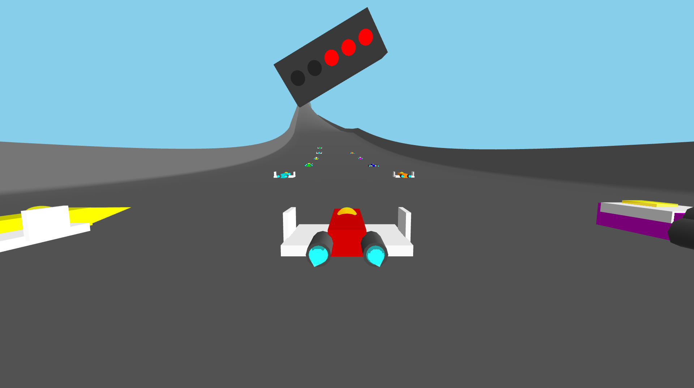

# Nebula Rush (Sci-Fi Racing Game)

*High-speed anti-gravity racing inspired by F-Zero and Wipeout.*

## Overview

**Nebula Rush** is a high-speed 3D racing game built directly in the browser using modern web technologies. You pilot an anti-gravity ship through a series of tracks and compete against 19 AI opponents to top the leaderboard.

This project demonstrates a custom physics engine, procedural mesh generation, and performant 3D rendering with Three.js.

### YouTube dev videos
I originally started building this game for free using Claude in the web browser. The free version of the model seems to be inhibited, so I eventually took it to my IDE. The first version was pretty rough!

* [F-Zero Clone for $0](https://www.youtube.com/watch?v=KXRh0A3ztOU)
* [Nebula Rush: 3D Sci-Fi Racer](https://www.youtube.com/watch?v=zMhtxbewmd0)





## Features

-   **High-Speed Anti-Gravity Physics**: specialized handling model featuring hovering, banking, drifting, and air-braking.
-   **Procedural Track Generation**:
    -   Complex 3D spline-based tracks with loops, banked turns, and verticality.
    -   Multiple unique tracks: *The Awakening*, *Nebula Complex*, *Hyperion Raceway*.
    -   Dynamic mesh generation for track surfaces and walls.
-   **Campaign Mode**:
    -   Multi-race championship with cumulative points.
    -   Unlockable tracks (planned).
-   **Ship & Pilot Selection**:
    -   **3 Ship Classes**: *Speedster* (Fast), *Fighter* (Balanced), *Tank* (Heavy Grip).
    -   **8 Unique Pilots**: Generated avatars with unique modifiers for Acceleration, Handling, and Velocity.
-   **Dynamic Environments**:
    -   Day/Night cycles and Weather effects (Rain/Snow/Fog) that affect visibility.
    -   Runtime environment selection for testing.
-   **19 Opponent AI**: Competitive AI agents that race alongside you, complete with lane-switching logic.
-   **Combat & Speed mechanics**:
    -   **Boost Pads**: Drivers must hit energized zones for speed bursts.
    -   **Strafing**: dedicated side-thrusters for tight cornering.
    -   **Jumping**: Vertical thrusters to hop over obstacles or cut corners.
-   **Full Race Loop**:
    -   Start sequence with functional traffic lights.
    -   5-Lap races with lap timing.
    -   Post-race leaderboard tracking rank and points.
-   **Dynamic Camera**: Smart camera system that prevents motion sickness while maintaining the sensation of extreme speed.
-   **Minimap**: Real-time track position visualization.
-   **Debug Tools**:
    -   Track Analysis for gradient/curvature.
    -   Lighting Playground (Dev only).

## Roadmap

Planned work — open to reordering as priorities shift.

**Sequencing note**: Backend & Accounts is the unblocker for several other sections. Online leaderboards, cross-device saves, multiplayer lobbies, and unlock persistence all sit on top of it. Cups depend on having enough tracks (one cup = 5 races on 5 *unique* tracks, so each new cup requires designing 5 new tracks).

### Difficulty
-   **Opponent stat boost**: AI is currently too easy to beat; bump opponent acceleration / top speed / handling so winning takes real driving.
-   **Track obstacles**: Add hazards beyond curve geometry (debris, gates, moving objects) so layout isn't the only difficulty lever.

### Progression
-   **Cups (Campaign)**: Group tracks into cups of **5 races on 5 unique tracks**, classic-racer style. Win a cup to unlock the next. Implication: every new cup requires 5 new tracks to be designed — that ongoing content work needs to be planned for.
-   **Unlocks**:
    -   Roughly half of the pilots locked at the start; unlock by progressing through cups.
    -   Tracks gated behind cups; the existing "Track Select" entry from the main menu becomes free-play across only the *unlocked* tracks.
-   **Onboarding / tutorial**: with cups, upgrades, currency, and (eventually) multiplayer layered on, a brand-new player hits a lot of concepts at once. Add at least a one-screen first-run prompt covering controls and race flow, ideally extending as new systems land.

### Ships & Customization
-   **Metallic ship finish** with **customizable paint** (primary/secondary colors, decals) so the player's ship is recognizable.
-   **Ship damage**: visual + (optionally) handling consequences when hitting walls / obstacles / other ships.

### Economy & Upgrades
-   **Credits / points**: in-game currency earned by finishing races and winning cups.
-   **Upgrade screen**: dedicated screen for spending credits on engine and ship part upgrades (acceleration, top speed, handling, braking, etc.) — adds a progression loop beyond unlocks.
-   **Open question**: upgrades per-ship vs. global (decide before implementing the screen).

### Visuals
-   **Track surface detail**: replace the flat-colored road with texture / pattern / panel lines / glow strips.
-   **Background art**: each track currently sits inside a plain sky — give each one a distinct backdrop (nebula, station, asteroid field, etc.) matching its name.

### Audio
-   **Engine pitch tied to speed**: continuously varying engine note instead of a fixed rumble.
-   **Opponent engine audio**: 3D-positioned engine noise from rival ships so you can hear them closing in.
-   **Impact / collision SFX**: distinct sounds for wall hits, ship-on-ship contact, and (eventually) damage events.

### Backend & Accounts
-   **Shared backend**: self-hosted Postgres on a Hetzner box, shared across multiple games via a common account / auth system.
-   **Cross-device saves**: profile, ship/pilot choices, unlock state, and settings persist via the account so progress follows the player across devices.
-   **Online leaderboards**: per-track (and eventually per-cup) global leaderboards, surfaced in-game.
-   **Registered vs. unregistered runs**: only authenticated runs on the production build count toward leaderboards / unlock progress. Local-dev builds and unauthenticated play do not get saved to the database or registered at all.
-   **Anti-cheat / server-authoritative scoring**: client-reported lap times are trivially spoofable from devtools, so a global leaderboard is meaningless without verification. Decide on a strategy (deterministic replays sent for server-side validation, server-side simulation, or input recording + re-sim) before going live with ranked leaderboards.
-   **Production build hardening**: hide cheat keys (`F` / `G`) *and* dev tools (Track Analysis, Lighting Playground, Environment Test, Ship Demo) from production builds. Registered runs must come from a hardened build.

### Multiplayer
-   **Lobby system**: open / matchmade lobbies for online races. Depends on the account system.
-   **Real-time multiplayer races**: race against other players over the network, with the same physics and tracks as single-player.

### Supplemental

Nice-to-have ideas; not blocking.

-   **Time Trial mode** with personal-best ghosts.
-   **Controller / gamepad support** (currently keyboard-only).
-   **Replay or photo mode** (extending the existing screenshot key).
-   **Mobile / touch support** (or an explicit "desktop only" decision).
-   **Achievements / stats tracking** (wins per pilot, fastest laps, etc.).

## Controls

| Action | Primary Key | Secondary Key |
| :--- | :--- | :--- |
| **Accelerate** | `W` | `Arrow Up` |
| **Steer Left/Right** | `Q` / `E` | `←` / `→` |
| **Strafe (Side Thrust)** | `A` / `D` | - |
| **Jump** | `Space` | `S` / `↓` |
| **Screenshot** | `P` | - |
| **Toggle HUD** | `H` | - |
| **Cheat: Instant Win** | `F` | - |
| **Cheat: Finish Opponents** | `G` | - |

> **Pro Tip**: Combine *Steer* and *Strafe* to drift through tight corners without losing speed!

## Tech Stack

-   **Runtime**: [React 19](https://react.dev/) + [Vite](https://vitejs.dev/)
-   **Language**: [TypeScript](https://www.typescriptlang.org/)
-   **3D Engine**: [Three.js](https://threejs.org/)
-   **Styling**: [Tailwind CSS](https://tailwindcss.com/)
-   **Avatars**: Nanobanana

## Architecture

-   **`src/App.tsx`**: Main UI router (Start, Selection Screens, Game).
-   **`src/components/Game.tsx`**: Main entry point for the 3D scene. Handles the race state machine (`intro`, `racing`, `finished`, `results`), game loop, and rendering coordination.
-   **`src/game/PhysicsEngine.ts`**: Core physics simulation. Calculates velocity, friction, hover suspension, and collision response. State is detached from Three.js objects for stability.
-   **`src/game/TrackFactory.ts`**: Procedural content generation. Uses Catmull-Rom splines to generate the race track geometry and placement of game elements (boost pads, start line).
-   **`src/game/OpponentManager.ts`**: Manages entity lifecycle for AI opponents and their simple steering behaviors.
-   **`src/game/EnvironmentManager.ts`**: Controls lighting, skybox, and weather effects.

## Getting Started

1.  **Install dependencies**:
    ```bash
    npm install
    ```

2.  **Start the development server**:
    ```bash
    npm run dev
    ```

3.  **Build for production**:
    ```bash
    npm run build
    ```
