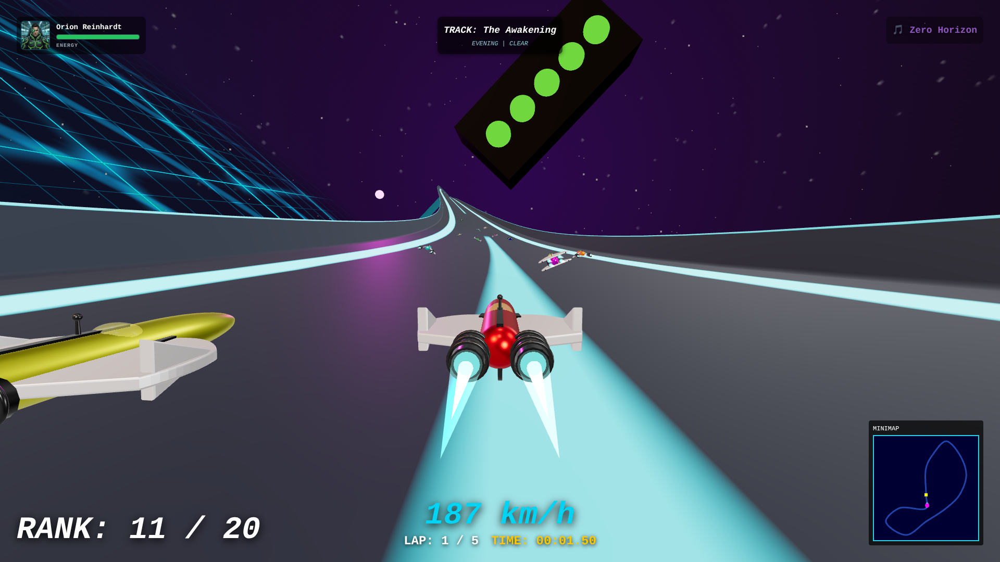

# Nebula Rush (Sci-Fi Racing Game)

*High-speed anti-gravity racing inspired by F-Zero and Wipeout.*

## Overview

**Nebula Rush** is a high-speed 3D racing game built directly in the browser using modern web technologies. You pilot an anti-gravity ship through a series of tracks and compete against 19 AI opponents to top the leaderboard.

This project demonstrates a custom physics engine, procedural mesh generation, and performant 3D rendering with Three.js.

### YouTube dev videos
I originally started building this game for free using Claude in the web browser. The free version of the model seems to be inhibited, so I eventually took it to my IDE. The first version was pretty rough!

* [F-Zero Clone for $0](https://www.youtube.com/watch?v=KXRh0A3ztOU)
* [First cup created for Nebula Rush: 5 race tracks completed!](https://www.youtube.com/watch?v=zMhtxbewmd0)
* [New ship graphics and background effects added](https://youtu.be/VOGkLEW-zQU)





## Features

-   **High-Speed Anti-Gravity Physics**: specialized handling model featuring hovering, banking, drifting, and air-braking.
-   **Procedural Track Generation**:
    -   Complex 3D spline-based tracks with loops, banked turns, and verticality.
    -   Ten tracks across two cups: the *Nebula Cup* (deep space) and the *Sunscorch Cup* (desert canyons).
    -   Dynamic mesh generation for track surfaces and walls, with per-track neon surface styling (glowing edge rails, centre line, checkered start/finish).
-   **Campaign Mode**:
    -   Cups of 5 races with cumulative points; clearing a cup unlocks the next one plus new pilots, ships and tracks.
-   **Ship & Pilot Selection**:
    -   **4 Ship Classes**: *Lancer* (Balanced), *Rapier* (Acceleration & Agility), *Sledgehammer* (Grip & Armour), *Kestrel* (Top Speed).
    -   **Ship paint customization**: primary + secondary colours with a live preview.
    -   **8 Unique Pilots**: Generated avatars with unique modifiers for Acceleration, Handling, and Velocity.
-   **Dynamic Environments**:
    -   Day/Night cycles and Weather effects (Rain/Fog) that affect visibility.
    -   Runtime environment selection for testing.
-   **19 Opponent AI**: Competitive AI agents that race alongside you, complete with lane-switching logic.
-   **Racing mechanics**:
    -   **Boost Pads**: Drivers must hit energized zones for speed bursts.
    -   **Strafing**: dedicated side-thrusters for tight cornering.
    -   **Energy**: hazards, wall scrapes and rival bumps drain your ship's energy; top up on the green recharge strip, or get destroyed at zero.
    -   **Hazards**: obstacle blocks and slip/slow patches on the track.
-   **Full Race Loop**:
    -   Start sequence with functional traffic lights.
    -   5-Lap races with lap timing.
    -   Post-race leaderboard tracking rank and points.
-   **Dynamic Camera**: Smart camera system that prevents motion sickness while maintaining the sensation of extreme speed.
-   **Minimap**: Real-time track position visualization.
-   **Race Photos**: capture in-race screenshots and review/download them (gallery + lightbox, single-zip download) on the results screen.
-   **Debug Tools**:
    -   Track Analysis for gradient/curvature.
    -   Lighting Playground (Dev only).

## Roadmap

See [ROADMAP.md](./ROADMAP.md) for what has shipped and what's next.

## Controls

| Action | Primary Key | Secondary Key |
| :--- | :--- | :--- |
| **Accelerate** | `W` | `Arrow Up` |
| **Brake** | `B` | - |
| **Steer Left/Right** | `Q` / `E` | - |
| **Strafe (Side Thrust)** | `A` / `D` | `←` / `→` |
| **Hop** | `Space` | `S` / `↓` |
| **Screenshot** | `P` | - |
| **Toggle HUD** | `H` | - |
| **Exit Race** | `Esc`, `Esc` | - |
| **Cheat: Finish Opponents** | `L` | - |

> **Pro Tip**: Combine *Steer* and *Strafe* to drift through tight corners without losing speed!

## Tech Stack

-   **Runtime**: [React 19](https://react.dev/) + [Vite](https://vitejs.dev/)
-   **Language**: [TypeScript](https://www.typescriptlang.org/)
-   **3D Engine**: [Three.js](https://threejs.org/)
-   **Styling**: [Tailwind CSS](https://tailwindcss.com/)
-   **Avatars**: Nanobanana

## Architecture

-   **`src/App.tsx`**: Main UI router (Start, Selection Screens, Game).
-   **`src/components/Game.tsx`**: Main entry point for the 3D scene. Handles the race state machine (`intro`, `racing`, `finished`, `results`), game loop, and rendering coordination.
-   **`src/game/PhysicsEngine.ts`**: Core physics simulation. Calculates velocity, friction, hover suspension, and collision response. State is detached from Three.js objects for stability.
-   **`src/game/TrackFactory.ts`**: Procedural content generation. Uses Catmull-Rom splines to generate the race track geometry and placement of game elements (boost pads, start line).
-   **`src/game/OpponentManager.ts`**: Manages entity lifecycle for AI opponents and their simple steering behaviors.
-   **`src/game/EnvironmentManager.ts`**: Controls lighting, skybox, and weather effects.

## Getting Started

1.  **Install dependencies**:
    ```bash
    npm install
    ```

2.  **Start the development server**:
    ```bash
    npm run dev
    ```

3.  **Build for production**:
    ```bash
    npm run build
    ```
